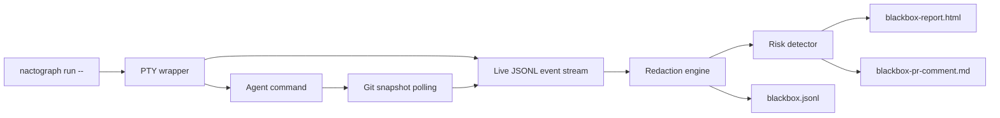

# Nactograph

<p align="center">
  <strong>Every AI agent run, replayed like evidence.</strong>
</p>

<p align="center">
  A local-first flight recorder for AI coding agents. Nactograph captures terminal output, git diffs, tests, redaction decisions, dependency changes, and risk findings into shareable reports.
</p>

<p align="center">
  <a href="https://nactograph.vercel.app"><strong>Website</strong></a>
  ·
  <a href="https://www.npmjs.com/package/nactograph"><strong>npm</strong></a>
  ·
  <a href="https://github.com/im-anishraj/noctograph/releases/tag/v0.1.0"><strong>Release v0.1.0</strong></a>
</p>

<p align="center">
  <a href="https://github.com/im-anishraj/noctograph/actions/workflows/ci.yml"></a>
  <a href="https://www.npmjs.com/package/nactograph"></a>
  
  <a href="LICENSE"></a>
</p>

```sh
nactograph run -- codex "fix failing auth tests"
```

Outputs:

```text
blackbox-report.html
blackbox.jsonl
blackbox-pr-comment.md
```


## Why

AI coding agents are fast, but review still needs evidence. What command ran? Which files changed? Did tests fail three times before passing? Did the agent touch `.env`, add a dependency, delete a test, or print a secret?

Nactograph turns an agent session into a local audit trail that a maintainer can inspect, attach to a pull request, or share without exposing raw secrets.

## Highlights

| Feature | What it gives you |
|---|---|
| PTY capture | The agent still runs normally while terminal output is recorded. |
| Git snapshots | Before/after file contents, unified diffs, and changed-file metadata. |
| JSONL event log | Append-only, machine-readable session history. |
| Redaction engine | Secret files, tokens, private hosts, and custom patterns are masked before storage. |
| Risk detector | Rule-based findings with severity and evidence. |
| Static report | One self-contained HTML file; no server needed. |
| PR summary | Markdown metrics and findings for code review. |

## Install

```sh
npm install -g nactograph
```

Requires Node 24 or newer.

## Quick Start

```sh
# 1. Run any coding agent or shell command through Nactograph
nactograph run -- codex "fix failing auth tests"

# 2. Open the newest report
cd blackbox-sessions
open */blackbox-report.html

# 3. Use the generated review artifacts
cat */blackbox-pr-comment.md
cat */blackbox.jsonl
```

You can wrap any command:

```sh
nactograph run -- npm test
nactograph run -- pnpm exec vitest run
nactograph run -- codex "refactor the auth middleware"
```

## What Gets Captured

| Event | Payload |
|---|---|
| `SessionStart` | command, cwd, git head, output directory, redaction state |
| `CommandRun` | command boundary and arguments |
| `CommandOutput` | ANSI-stripped terminal stream with redaction applied |
| `FileSnapshot` | before/after content, unified diff, hash, existence state |
| `TestRun` | status, command, duration, output summary |
| `DependencyChange` | added, removed, or changed packages |
| `RiskyAction` | rule, severity, timestamp, evidence |
| `SessionEnd` | exit code, signal, duration, artifact inventory |

## How It Works



Nactograph runs locally. It does not need a hosted recorder, database, or background service. Session artifacts are written to `./blackbox-sessions` by default.

## Risk Rules

Nactograph is intentionally rule-based so maintainers can understand and improve every finding.

| Rule | Severity | Detects |
|---|---|---|
| `secret_access` | high | secret-like file access or token-like output |
| `lockfile_churn` | medium | repeated lockfile changes |
| `dependency_added` | medium | newly added packages |
| `dependency_removed` | medium | removed packages |
| `test_deleted` | high | deleted `*.test.*` or `*.spec.*` files |
| `test_failure_loop` | medium | repeated failed test runs |
| `scope_creep` | medium | edits outside the expected working area |
| `destructive_command` | high | `rm -rf`, force push, database drops, and similar commands |
| `license_change` | medium | license file modifications |
| `env_write` | high | writes to `.env` files |
| `large_deletion` | medium | diffs with 100+ removed lines |

## Reports

| Artifact | Audience | Use it for |
|---|---|---|
| `blackbox-report.html` | humans | timeline replay, diffs, terminal output, filters, risk findings |
| `blackbox.jsonl` | tools | audits, automation, future integrations |
| `blackbox-pr-comment.md` | reviewers | pull request summary with metrics and findings |

## CLI Reference

```sh
nactograph run [options] -- <command...>
```

| Flag | Default | Description |
|---|---:|---|
| `--output-dir <dir>` | `./blackbox-sessions` | Directory for session folders and report artifacts. |
| `--redact` | on | Redact secrets before anything is stored. |
| `--no-redact` | off | Disable redaction for private local debugging. |
| `--redact-patterns <path>` | none | Newline-delimited custom redaction patterns. Supports globs and `/regex/flags`. |

## Redaction

Default redaction covers common secret files and values:

- `.env`, `.env.*`, `*.pem`, `*.key`, `id_rsa`, `secrets.*`, `credentials.*`
- `AWS_ACCESS_KEY_ID`, `AWS_SECRET_ACCESS_KEY`, `GITHUB_TOKEN`, `OPENAI_API_KEY`
- long base64-like tokens
- private IP ranges
- localhost tokens in URLs

Redaction audit entries include rule names and counts, never the raw value.

## Monorepo

```text
packages/core     shared event schemas, redaction, risk detection
packages/cli      nactograph CLI, PTY capture, git snapshots, report generation
packages/viewer   embeddable React report viewer
packages/site     Vercel landing page
```

## Development

```sh
pnpm install
pnpm verify
```

Useful package commands:

```sh
pnpm --filter nactograph dev -- run -- npm test
pnpm --filter @nactograph/site build
pnpm --filter nactograph-core test
```

## Release

Releases are driven by GitHub Actions:

- CI runs tests on pull requests.
- npm publishing uses trusted publishing.
- tagged releases attach binary builds for Linux, macOS, and Windows.

## Contributing

Contributions are welcome. Read [CONTRIBUTING.md](CONTRIBUTING.md), follow Conventional Commits, and keep changes focused.

Good first areas:

- more risk rules
- richer event cards
- additional redaction patterns
- integrations for PR comments
- better examples from real agent sessions

## Launch Copy

> I let an AI agent fix a bug. Nactograph replayed every command, every file edit, and the exact moment it broke the tests.

## License

MIT
