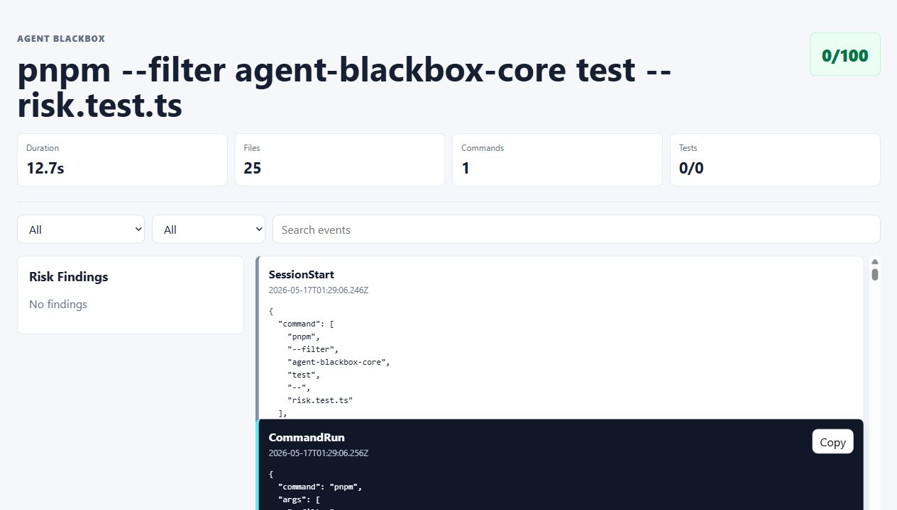
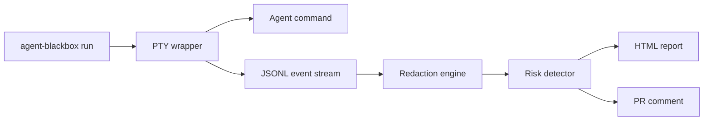

# Agent Blackbox

Local-first flight recorder for AI coding agents.

```sh
agent-blackbox run -- codex "fix failing auth tests"
```

Outputs:

```text
blackbox-report.html
blackbox.jsonl
blackbox-pr-comment.md
```



## Install

```sh
npm install -g agent-blackbox
```

Requires Node 24 or newer.

## Quick Start

```sh
agent-blackbox run -- codex "fix failing auth tests"
cd blackbox-sessions
open */blackbox-report.html
cat */blackbox-pr-comment.md
cat */blackbox.jsonl
```

## How It Works



Agent Blackbox runs the agent command in a pseudo-terminal so the session still feels normal. It records command output, git snapshots, diffs, dependency changes, test runs, redaction audit summaries, and risk findings into a local session folder.

## CLI

```sh
agent-blackbox run [options] -- <command...>
```

| Flag | Default | Description |
|---|---:|---|
| `--output-dir <dir>` | `./blackbox-sessions` | Directory for session folders and report artifacts. |
| `--redact` | on | Redact secrets before anything is stored. |
| `--no-redact` | off | Disable redaction for private local debugging. |
| `--redact-patterns <path>` | none | Newline-delimited custom redaction patterns. Supports globs and `/regex/flags`. |

## Reports

- `blackbox-report.html`: self-contained report viewer with timeline, filters, fuzzy search, diffs, output cards, and risk findings.
- `blackbox.jsonl`: newline-delimited validated event stream.
- `blackbox-pr-comment.md`: Markdown summary for pull requests.

## Redaction

Default redaction catches common secret files, cloud tokens, GitHub and OpenAI keys, long base64-like tokens, private IPs, and localhost URL tokens. Redaction audit entries include rule names and counts, never raw values.

## Release Artifacts

Each release publishes:

- npm package: `agent-blackbox`
- npm support package: `agent-blackbox-core`
- binaries for Linux, macOS, and Windows

## Contributing

See [CONTRIBUTING.md](CONTRIBUTING.md). This project uses Conventional Commits, pnpm workspaces, Vitest, React 18, Vite, and GitHub Actions.

## Launch Copy

> I let an AI agent fix a bug. Agent Blackbox replayed every command, every file edit, and the exact moment it broke the tests.

## License

MIT
